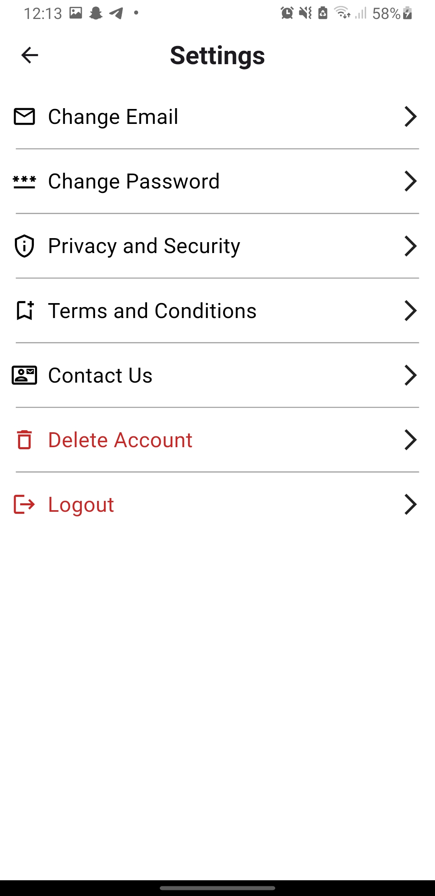

# Job Court
Built a Flutter-based mobile app similar to Tinder, where users swipe right or left to like or dislike other profiles. Each profile features photos, a bio, and interests. Users can start chats with others who share mutual interests, enabling meaningful professional or social connections

