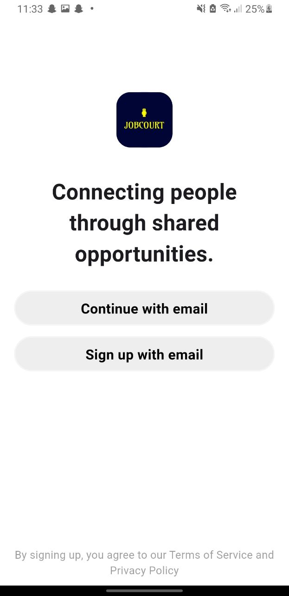
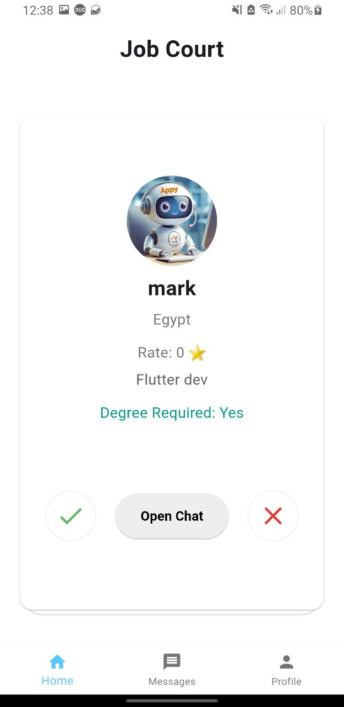
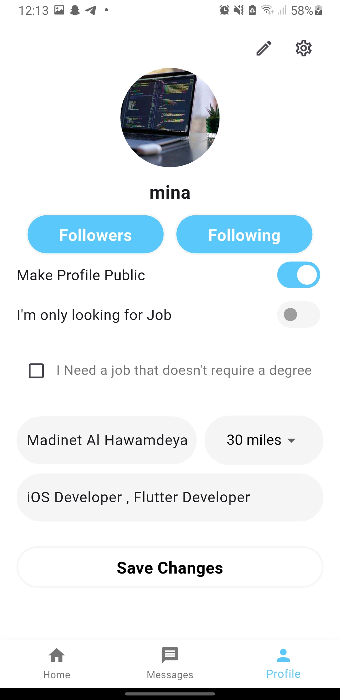
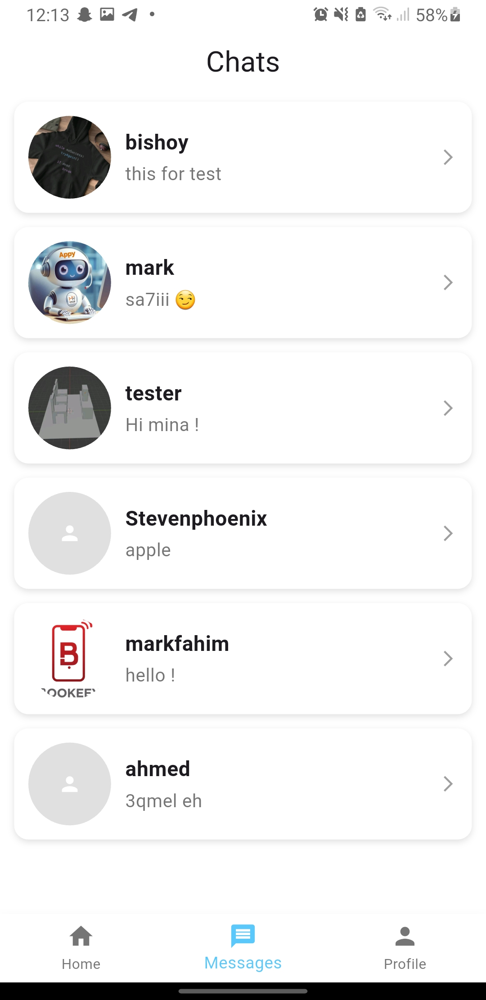
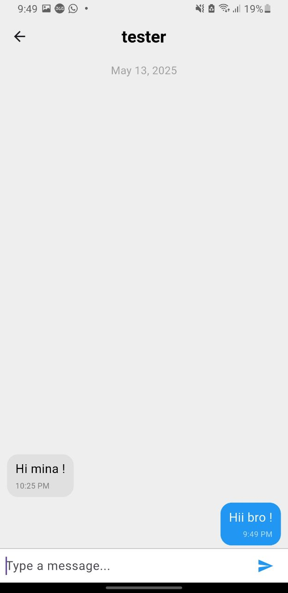
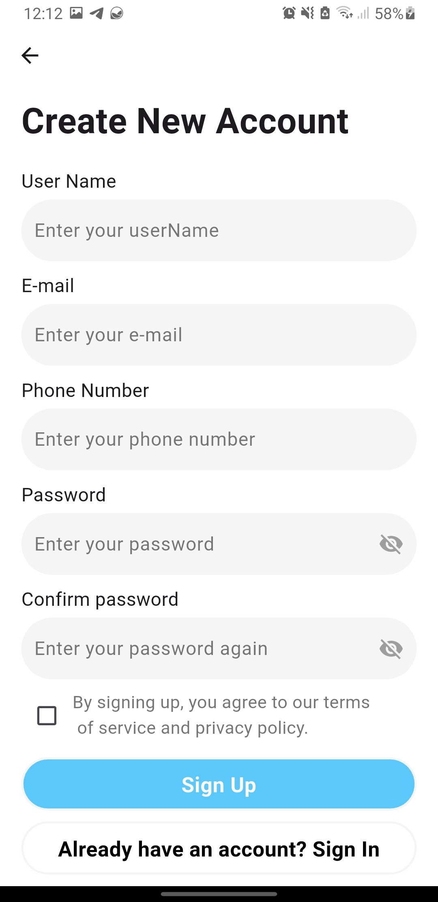
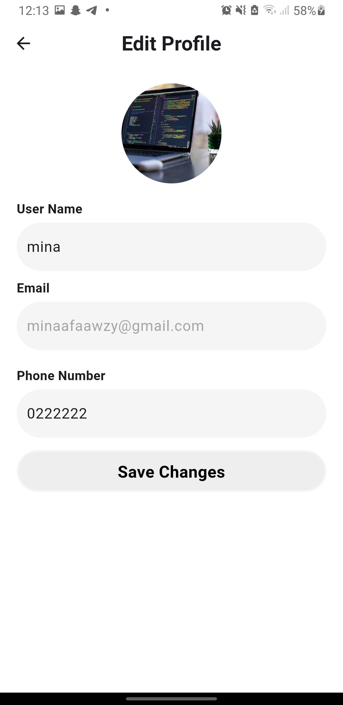

# 📱 JobCourt - Swipe, Connect & Chat

JobCourt is a Flutter-based mobile application inspired by Tinder's swipe mechanism. Users can swipe right to like or left to pass on profiles. Each profile displays user photos, a short bio, and their professional or personal interests. When two users show mutual interest, they can start a conversation through the built-in chat feature—enabling meaningful social or professional connections.

The app is built using **Flutter** and follows the **MVVM Clean Architecture** pattern with a strong focus on **clean code principles**. It integrates **Firebase Authentication** for secure login and registration, and uses **Firestore Database** as a real-time NoSQL database for chat messages and user profiles.

      
      

